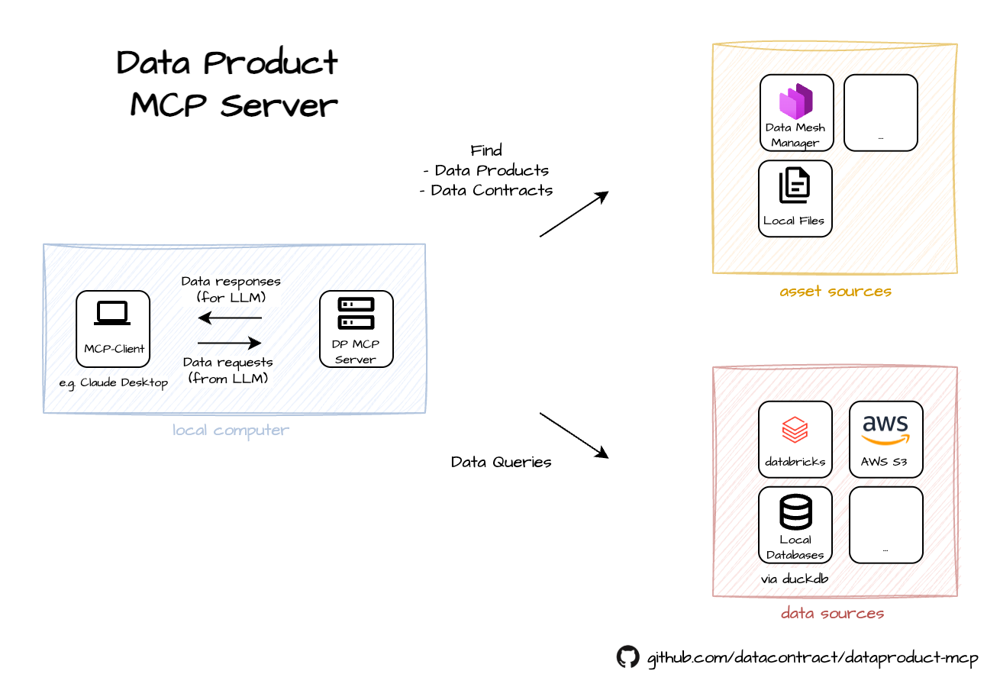

# Diagrams for DataProduct MCP

## Feature Overview

## C4

The diagrams use standard Mermaid syntax for maximum IDE compatibility:

### 1. Context Diagram (`c4/context.mmd`)
Shows the DataProduct MCP system in context with its users and external systems.

### 2. Container Diagram (`c4/container.mmd`)
Shows the major containers (applications/services) that make up the DataProduct MCP system.

### 3. Component Diagram (`c4/component.mmd`)
Shows the major components inside the MCP Server container.

### 4. Data Flow Diagram (`c4/data_flow.mmd`)
Shows the sequence of operations for handling data queries.

## Color Coding

The diagrams use C4 color conventions:
- Blue: System components and containers
- Gray: External systems
- Dark blue: People/users

## Key Architectural Elements

- **MCP Server**: Main entry point that handles API requests
- **Asset Manager**: Central component that manages access to data products and contracts
- **Asset Identifier System**: Handles the URN-based identifier scheme
- **Federated Query Engine**: Enables querying across multiple data sources
- **Plugin System**: Extensible architecture for different data and asset sources

## Data Flow

The system follows this general workflow:
1. Client sends a query request to the MCP Server
2. Server uses Asset Manager to resolve identifiers and locate data sources
3. For simple queries, data is fetched directly from a single source
4. For complex queries, the Federated Query Engine coordinates retrieval and joining of data from multiple sources
5. Results are returned to the client